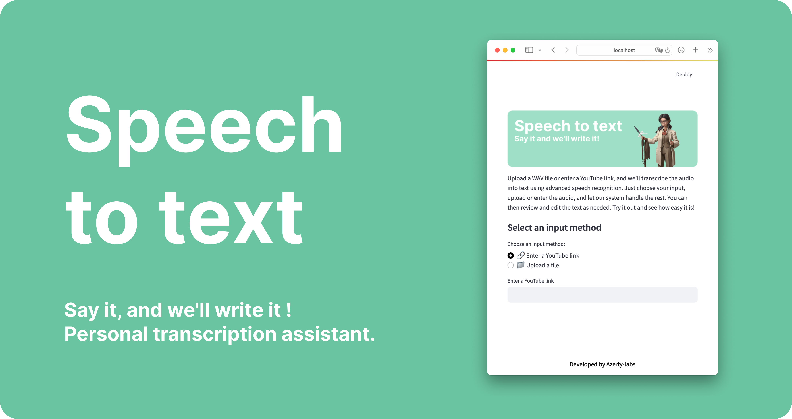

<div align="center">
  
</div>

<h3 align="center">
  <b><a href="azerty-labs.com">Online App</a></b>
  •
  <b><a href="#usage">Usage</a></b>
  •
  <b><a href="https://github.com/azerty-labs/speech-to-text-app/blob/main/doc/capture.png">App Screenshot</a></b>
</h3>

<div align="center">
  <a href="https://opensource.org/licenses/MIT">
    
  </a>
  
</div>
</br>

<p align="center">
  The <b>Speech to Text App</b> is a Streamlit application that allows users to transcribe speech to text from either an uploaded audio file or a YouTube video. The app leverages OpenAI's <a href="https://github.com/openai/whisper">Whisper</a> speech-to-text library to provide accurate and efficient transcriptions.
</p>

## Features

The Speech to Text App offers the following features:

- **Transcribe Audio Files:** Upload an audio file (e.g., MP3, WAV) to transcribe the speech into text.
- **Transcribe YouTube Videos:** Enter a YouTube link to automatically extract and transcribe the audio content.

## How it Works

The app uses OpenAI's Whisper library to perform speech-to-text transcription. Whisper is a general-purpose speech recognition model trained on a large dataset of diverse audio. It can handle various languages and accents, making it a versatile tool for transcribing different types of speech.

When a user uploads an audio file or provides a YouTube link, the app processes the audio through Whisper, which converts the spoken content into written text. This text is then displayed in the app's interface, allowing users to copy or save it as needed.

## Run app locally
If you want to run the **speech-to-text-app** streamlit app locally. Multiple solution are possible :

1. **Run the app directly in a virtual environnement**
    
    clone repository:
    ```
    git clone https://github.com/chloelavrat/speech-to-text-app.git
    cd speech-to-text-app
    ```
    Create, activate and install your environnement:
    ```
    python -m venv .venv
    source .venv/bin/activate
    pip install -r requirements.txt
    ```
    Run the app using streamlit:
    ```
    streamlit run streamlit_app.py
    ```

2. **Run the app using docker**

    Build the `speech-to-text-app` docker container:
    ```
    docker build -t speech-to-text-app .
    ````
    Run the container at a specified port (here 8501) 
    ```
    docker run -p 8501:8501 speech-to-text-app
    ```
    Go to your web browser and access [localhost:8501](http://localhost:8501)

## Contributing

This is an open-source project, and contributions are always welcome. If you would like to contribute to the project, you can do so by submitting a pull request or by creating an issue on the project's GitHub page.

## License

This project is licensed under the MIT License. See the [LICENSE](LICENSE) file for details.